# Markdown

> - 书籍：[了不起的Markdown ](http://reader.epubee.com/books/mobile/79/7985ba2da6fa4b7b346e9c3f4c64fbf5/text00001.html)
> - [博客编辑神器：Markdown编辑器](https://blog.csdn.net/axi295309066/article/details/49176243)
> - [Typora画流程图、时序图(顺序图)、甘特图](https://www.jianshu.com/p/7ddbb7dc8fec)

## Markdown语法

**Markdown 是一种轻量级标记语言，它允许人们使用易读易写的纯文本格式编写文档。**

目录

- 用 [TOC]来生成目录

```
[TOC]
```

<!-- more -->

### 段落格式

***

#### 标题h1-h6 ctrl + 1~6 ctrl + 0 ctrl + =/ -

```html
#
##
###
####
#####
######
#######
```

#### 列表 有序和无序 ctrl + shift + [        ctrl + shift + ]

1. 有序列表
   1. 有序列表
   2. 有序列表
2. 有序列表

- 无序列表
  - 无序列表
  - 无序列表
- 无序列表

```
1. 有序列表
- 无序列表
```

#### 引用 ctrl+shift +Q

> 引用 如果你需要在文稿中引用一段别处的句子，那么就要用到「引用」格式

```
>引用
```

#### **粗体**和*斜体* ctrl +b ctrl + i 删除线  alt + shift + 5

```
**粗体**和*斜体*
```

#### 高亮

```
==高亮==
``高亮``
```

==高亮==

``高亮``

#### ^上标^文字~下标~

```
^上标^~下标~
```

#### 注释

<!---->

#### 链接与图片

[]()

```
//插入链接
[文字](网络链接)
//插入图片

```

#### 分割线

***

```
***
```

#### 表格 ctrl +T

|      |      |
| ---- | ---- |
|      |      |

#### 代码  ctrl + shift + k

```js
​```编程语言
```

####   制作待办事项To-do List

你只需要在待办的事项文本或者清单文本前加上- [ ]、- [x]即可。

\- [ ] 表示未完成，- [x] 表示已完成。

注：键入字符与字符之间都要保留一个字符的空格。

- [x] 已完成1
  - [ ] 未完成
  - [x] 没有完成
- [x] 已完成2
- [ ] 已完成3

```
- [] 未完成 -空格[空格]空格
- [x] 完成	
```

脚注

```
[^footnote]
```

markdown更改图片大小

```

或
```

### 图表

#### 高效绘制 流程图、序列图、甘特图

###### 流程图

流程图分为竖向和横向两大类，竖向包括自上而下和自下而上两种顺序，横向包括从右到左和从左到右两种顺序。

``mermaid n. 美人鱼（传说中的）；女子游泳健将
graph n. 图表；曲线图``

> 其对应语法分别为：graph TB/graph BT/graph RL/graph LR。
>
> TB - top bottom（自上而下）
> BT - bottom top（自下而上）
> RL - right left（从右到左）
> LR - left right（从左到右）
>
> 
>
> //不能使用 A <--的写法

```
语法：```mermaid
mermaid mermaid mermaid mermaind mermaind mermaind 
graph graph graph
graph RL 
B-->A
graph LR
A-->C
graph TB 
C-->D
graph BT 
D-->C

graph TD
	A[ONE DAY] --> B(Plan)
	B --> |My plan| C{Lit me do}
	C --> |One| D[code]
	C --> |two| E[eat]
	C --> |three| F[sleep]
```

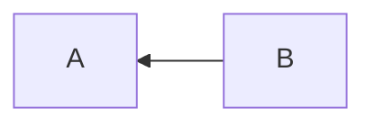

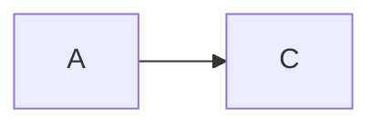

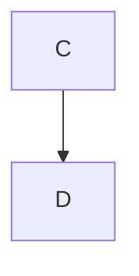

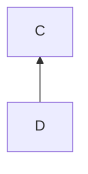

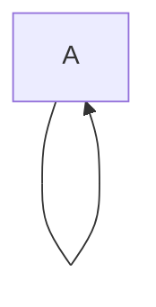


对框线形状的调整

```
​```mermaid
graph LR 
A[直角四边形]
B((圆形))
C(形)
D{菱形}
```

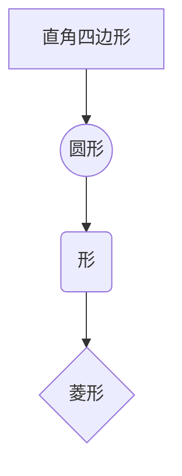


对箭头的调整

```
graph LR 
A[A]---B[B]
C[C]-->D[D]
E[E]-->|描述| F[F]
```

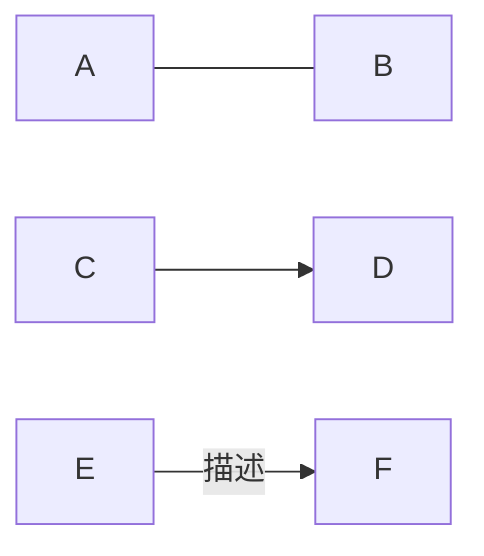


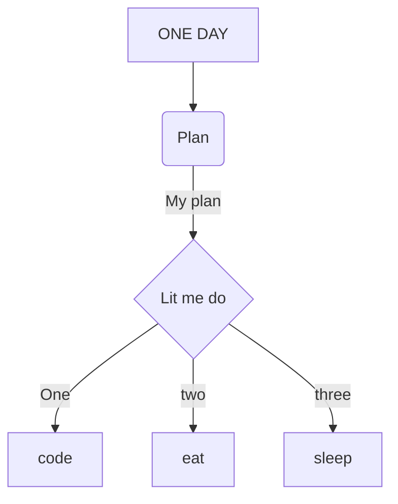

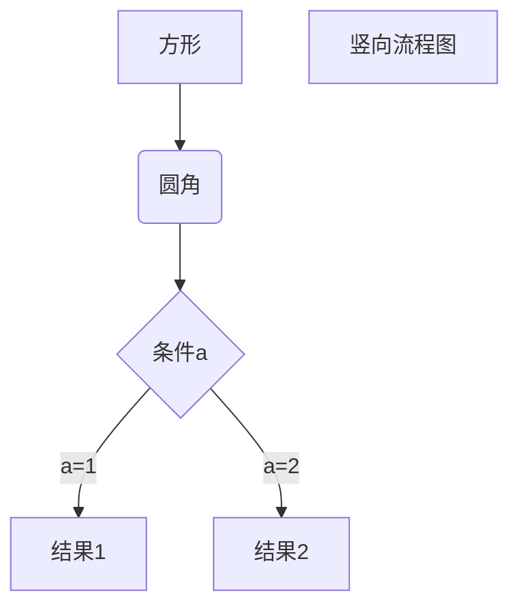

###### 标准流程图

```
标准流程图源码格式：

​```flow
st=>start: 开始框
op=>operation: 处理框
cond=>condition: 判断框(是或否?)
sub1=>subroutine: 子流程
io=>inputoutput: 输入输出框
e=>end: 结束框
st->op->cond
cond(yes)->io->e
cond(no)->sub1(right)->op
​```
```


```flow
st=>start: 开始框
op=>operation: 处理框
cond=>condition: 判断框(是或否?)
sub1=>subroutine: 子流程
io=>inputoutput: 输入输出框
e=>end: 结束框
st->op->cond
cond(yes)->io->e
cond(no)->sub1(right)->op
```


```
4、标准流程图源码格式（横向）：

​```flow
st=>start: 开始框
op=>operation: 处理框
cond=>condition: 判断框(是或否?)
sub1=>subroutine: 子流程
io=>inputoutput: 输入输出框
e=>end: 结束框
st(right)->op(right)->cond
cond(yes)->io(bottom)->e
cond(no)->sub1(right)->op
​```
```


```flow
st=>start: 开始框
op=>operation: 处理框
cond=>condition: 判断框(是或否?)
sub1=>subroutine: 子流程
io=>inputoutput: 输入输出框
e=>end: 结束框
st(right)->op(right)->cond
cond(yes)->io(bottom)->e
cond(no)->sub1(right)->op
```


###### **UML时序图 ** sequence || mermaid

```
UML时序图源码样例：
​```sequence
对象A->对象B: 对象B你好吗?（请求）
Note right of 对象B: 对象B的描述
Note left of 对象A: 对象A的描述(提示)
对象B-->对象A: 我很好(响应)
对象A->对象B: 你真的好吗？
​```
```

```sequence
对象A->对象B: 对象B你好吗?（请求）
Note right of 对象B: 对象B的描述
Note left of 对象A: 对象A的描述(提示)
对象B-->对象A: 我很好(响应)
对象A->对象B: 你真的好吗？
```


```
UML标准时序图样例：
​```mermaid
%% 时序图例子,-> 直线，-->虚线，->>实线箭头
  sequenceDiagram
    participant 张三
    participant 李四
    张三->王五: 王五你好吗？
    loop 健康检查
        王五->王五: 与疾病战斗
    end
    Note right of 王五: 合理 食物 <br/>看医生...
    李四-->>张三: 很好!
    王五->李四: 你怎么样?
    李四-->王五: 很好!
​```
```


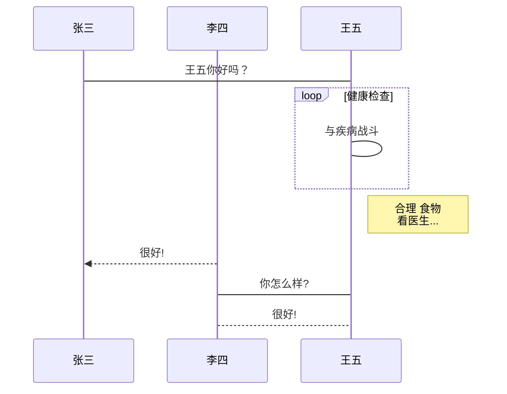


```
UML时序图源码复杂样例：
​```sequence
Title: 标题：复杂使用
对象A->对象B: 对象B你好吗?（请求）
Note right of 对象B: 对象B的描述
Note left of 对象A: 对象A的描述(提示)
对象B-->对象A: 我很好(响应)
对象B->小三: 你好吗
小三-->>对象A: 对象B找我了
对象A->对象B: 你真的好吗？
Note over 小三,对象B: 我们是朋友
participant C
Note right of C: 没人陪我玩
​```
```


```sequence
Title: 标题：复杂使用
对象A->对象B: 对象B你好吗?（请求）
Note right of 对象B: 对象B的描述
Note left of 对象A: 对象A的描述(提示)
对象B-->对象A: 我很好(响应)
对象B->小三: 你好吗
小三-->>对象A: 对象B找我了
对象A->对象B: 你真的好吗？
Note over 小三,对象B: 我们是朋友
participant C
Note right of C: 没人陪我玩
```


###### 甘特图

```
​```mermaid
%% 语法示例
        gantt
        dateFormat  YYYY-MM-DD
        title 软件开发甘特图
        section 设计
        需求                      :done,    des1, 2014-01-06,2014-01-08
        原型                      :active,  des2, 2014-01-09, 3d
        UI设计                     :         des3, after des2, 5d
    未来任务                     :         des4, after des3, 5d
        section 开发
        学习准备理解需求                      :crit, done, 2014-01-06,24h
        设计框架                             :crit, done, after des2, 2d
        开发                                 :crit, active, 3d
        未来任务                              :crit, 5d
        耍                                   :2d
        section 测试
        功能测试                              :active, a1, after des3, 3d
        压力测试                               :after a1  , 20h
        测试报告                               : 48h
​```
```

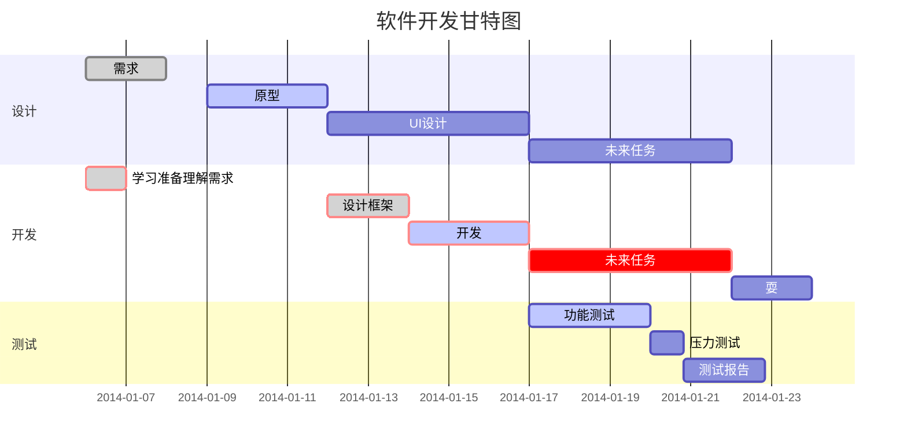

## Markdown 光亮

> [Markdown编辑器语法之代码高亮、标记和文字颜色](https://blog.csdn.net/weixin_42662955/article/details/91156180)

概念 红色

<font color="red" size="4" style="background:#F8F8F8">JavaScript做到在一个设定的时间间隔之后来执行代码，而不是在函数被调用后立即执行，这就是计时事件</font>

必记 

``必记``

### 常用光亮

==这是光亮==

``这也是光亮``

### 文字颜色改变

``font <face="" color= size= >``

```text
Size：规定文本的尺寸大小，取值从 1 到 7 ，浏览器默认值是 3.
<font face="黑体">我是黑体字</font>
<font face="微软雅黑">我是微软雅黑</font>
<font face="STCAIYUN">我是华文彩云</font>
<font color=#0099ff size=3 face="黑体">color=#0099ff size=3 face="黑体"</font>
<font color=#00ffff size=4>color=#00ffff size=4</font>
<font color=gray size=5>color=gray size=5</font>
```

Size：规定文本的尺寸大小，取值从 1 到 7 ，浏览器默认值是 3.
<font face="黑体">我是黑体字</font>
<font face="微软雅黑">我是微软雅黑</font>
<font face="STCAIYUN">我是华文彩云</font>
<font color=#0099ff size=3 face="黑体">color=#0099ff size=3 face="黑体"</font>
<font color=#00ffff size=4>color=#00ffff size=4</font>
<font color=gray size=5>color=gray size=5</font>

<font color=blue size=6>这是蓝色</font>

### 文字底色改变

``style=background:颜色``

```
<font style=background:red size=5 color=white>红色重点</font>
<font style=background:#000000 size=5 color=white>黑色重点</font>
```

<font style=background:red size=5 color=white>红色重点</font>

<font style=background:#000000 size=5 color=white>黑色重点</font>

```xml
<p align="left">居左文本</p>
<p align="center">居中文本</p>
<p align="right">居右文本</p>
```

## Typora安装Pandoc

Pandoc是一个标记语言转换工具，可实现不同标记语言间的格式转换。

Typora的文件导入/导出功能是使用Pandoc把Markdown文件转换成不同格式的文件，所以如果想使用文件导入/导出功能，必须要先安装Pandoc。

如果不安装Pandoc，Typora只支持导出HTML和PDF格式的文件。

如果安装了Pandoc，Typora支持的文件格式如下。

· 导入文件格式。

如.docx、.latex、.tex、.ltx，.rst、.rest、.org、.wiki、.dokuwiki、.textile、.opml、.epub等。

· 导出文件格式。

如HTML、PDF、Word、OpenOffice、RTF、ePub、LA TEX、MediaWiki、PNG等。

Pandoc的安装步骤如下。

打开https://github.com/jgm/pandoc/releases/latest，下载最新的安装包（注意要对应本机的操作系统），双击后按照提示一步一步安装即可。

 如果想使用自动补全表情符号的功能，需要到【偏好设置】中去激活：【偏好设置】→【编辑器】→【触发自动完成】→勾选【Emoji表情】，然后在输入Emoji标记语法时，Typora会自动给出补全信息，

### Typora扩展语法

Typora扩展了下画线、数学公式、目录、脚注、上标和下标、图表操作等功能，并且支持很多HTML标签，使排版格式变得更加齐全。

## Markdowm Emoji

Emoji 表情网站

方法一

[Typora Emoji图标 ](https://www.cnblogs.com/wangjs-jacky/p/12011208.html)

[Emoji CSS](https://emoji-css.afeld.me/)

输入+`:kissing_smiling_eyes:`

### :kissing_smiling_eyes: :scream: :derelict_house:

方法二

[Emoji Homepage 👀 - Copy and paste emoji. 💨 Fast and 👌 Simple.](http://emojihomepage.com/)

使用标题`#`控制Emoji大小

### 😴 🚵‍♀️ 👨‍👨‍👧‍👧 ☝ 🤞 🙈

## GitHub的README.md的svg图标

[GitHub的README.md制作好看的svg图标](https://www.jianshu.com/p/e61b0796f695)

官方文档：[Shields.io: Quality metadata badges for open source projects](https://shields.io/#/)

### 语法

```
https://img.shields.io/badge/<图标前部分的文字>-<图标后部分的文字>-<颜色>.svg
注意点：
1、因为-是会用到的分割字符，如果文字中有-，如要用--来代替，如Objective-C要写成Objective--C
2、颜色可以是支持的英文，也可以是6位的16进制的字符串，如blue、0000ff
3、可以支持圆角、矩形样式、社交样式、还可以添加logo
```

### 实例


```cpp

```


```cpp

```


```cpp

```


```cpp

```


```cpp

```

### 测试


