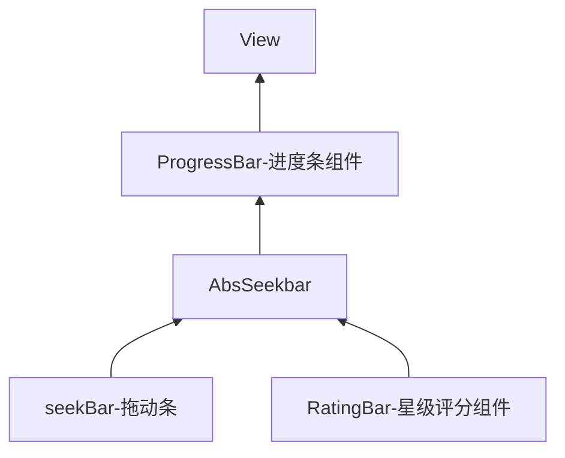

# Android

## Android 学习路线


## Android  Awesome

### 安卓原生UI库

[XUI 一个简洁而优雅的Android原生UI框架](https://www.wanandroid.com/blog/show/2680)

[QMUI Android - 致力于提高项目 UI 开发效率](https://qmuiteam.com/android)

XUI 离线使用教程：[手把手教你使用XUI的正确姿势 | 码农网](https://www.codercto.com/a/92454.html)


## APP 基础知识

|         |                                                 |
| ------- | ----------------------------------------------- |
| IOS     |                                                 |
| Android | 原生开发  <br />混合开发<br />vue、react-native |
| H5 开发 |                                                 |

### Android


### IOS


### H5


## Android Studio 使用

### 快捷键


### 常用操作

### 问题

SDK Manager

Tools => Android => SDK Manager   => Launch Standalone SDK Manager  

Proxy Setting 

```
mirrors.neusoft.edu.cn
80
Other:Force
```

maven： jar 包管理 

### 离线安装Gradle

gradle 项目构建

gradle下载安装失败，使用gradle 离线下载

`gradle-wrapper.properties`

```properties
#distributionUrl=https\://services.gradle.org/distributions/gradle-5.4.1-all.zip
distributionUrl=file:///C:/Users/Administrator/.gradle/wrapper/dists/gradle-5.4.1-all.zip
```

### 更改`gradle`阿里源

`build.gradle`

```json
buildscript {
    repositories {
        maven { url 'http://maven.aliyun.com/nexus/content/groups/public/' }
        maven{ url 'http://maven.aliyun.com/nexus/content/repositories/jcenter'}
        maven { url 'http://maven.aliyun.com/repository/google' }
        mavenLocal()
        mavenCentral()
    }
}

allprojects {
    repositories {
        maven { url 'http://maven.aliyun.com/nexus/content/groups/public/' }
        maven{ url 'http://maven.aliyun.com/nexus/content/repositories/jcenter'}
        maven { url 'http://maven.aliyun.com/repository/google' }
        mavenLocal()
        mavenCentral()
    }
}
```


## Android 安装环境

> **Eclipse + ADT + SDK：** **Android Studio + SDK：**

### Java 安装


### Gradle安装


### Android Studio安装

Android Studio 集成开发工具包(软件)

Android SDK 开发工具包

- 安装JDK
- 安装Android Studio(软件 IDEA) 
	- 勾选 Android SDK
	- 勾选 Android Virtual Device
	- Android SDK 安装路径
	- Android Studio
- Android Studio：是一个Android集成开发工具，基于Intellij IDE，类似Eclipse ADT，提供了集成的Android开发工具用于开发调试， 内置Android SDK 以及其他开发需要的工具

### Genymotion模拟器安装

Android虚拟设备：第三方模拟器 Genymotion


### Android 自带DroidDraw工具设计Android界面


软件下载：[droiddrawr.jar](http://static.runoob.com/download/droiddrawr.jar)

###  SDK更新不了问题解决

[SDK更新不了问题解决 | 菜鸟教程](https://www.runoob.com/w3cnote/android-tutorial-sdk-problem-solve.html)


## Android 基础知识

背景

Android系统是由Andy Rubin创建的，后来被Google

Android1.5 ~11

| 系统版本名称                                  | API版本号 | 发布时间   |
| :-------------------------------------------- | :-------- | :--------- |
| Android 1.5：Cupcake：纸杯蛋糕                | 3         | 2009.4.30  |
| Android 1.6：Donut：甜甜圈                    | 4         | 2009.9.15  |
| Android 2.0/2.0.1/2.1：Eclair：松饼           | 5/6/7     | 2009.10.26 |
| Android 2.2/2.2.1：Froyo：冻酸奶              | 8         | 2010.5.20  |
| Android 2.3：Gingerbread：姜饼                | 9         | 2010.12.7  |
| Android 3.0：Honeycomb：蜂巢                  | 11        | 2011.2.2   |
| Android 3.1：Honeycomb：蜂巢                  | 12        | 2011.5.11  |
| Android 3.2：Honeycomb：蜂巢                  | 13        | 2011.7.13  |
| Android 4.0：Ice Cream Sandwich：冰激凌三文治 | 14        | 2011.10.19 |
| Android 4.1：Jelly Bean：果冻豆               | 16        | 2012.6.28  |
| Android 4.2：Jelly Bean：果冻豆               | 17        | 2012.10.30 |
| Android 4.3：Jelly Bean：果冻豆               | 18        | 2013.7.25  |
| Android 4.4：KitKat：奇巧巧克力               | 19        | 2013.11.01 |
| Android 5.0：Lollipop：棒棒糖                 | 21        | 2014.10.16 |
| Android M：预览版                             | 22        | 2015.5.28  |

开发版本的选择

Android 的碎片化

Java (逻辑代码) + XML(美化)

[真机安装失败：The application could not be installed: INSTALL_FAILED_TEST_ONLY - 代码先锋网](https://www.codeleading.com/article/44393585402/)

Android 

版本

开发工具Android Studio


Fragment(碎片)基本概述

*Android的四大组件Activity，Service，BroadCastReceiver，ContentProvider* 

*以及他们之间的纽带：Intent*

[片段  |  Android 开发者  |  Android Developers](https://developer.android.com/guide/components/fragments.html)

### 真机安装失败：The application could not be installed: INSTALL_FAILED_TEST_ONLY

技术标签： [各种问题](https://www.codeleading.com/tag/各种问题/)

错误：

```java
Installation did not succeed.
The application could not be installed: INSTALL_FAILED_TEST_ONLY
Installation failed due to: 'null'

1234
```

解决：
在gradle.properties 文件中添加`android.injected.testOnly=false`

> [Android基础入门](https://www.runoob.com/w3cnote/android-tutorial-intro.html)
>
> [导航原则  |  Android 开发者  |  Android Developers](https://developer.android.com/guide/navigation/navigation-principles?hl=zh-cn)
>
> [Android 开发者  |  Android Developers](https://developer.android.google.cn/index.html)

### 概念

- Android 是一种基于Linux的自由、开发源代码的操作系统，主要用于移动设备智能手机和平台电脑。

- Android是基于Linux平台的开源手机操作系统的名称，该平台由操作系统、中间件、用户界面和应用软件组成。

### 系统架构

- 应用程序层
- 应用程序框架层
- 系统运行库层
- Linux内核层

### 四大组件

- 活动（Activity）
- 服务（Service）
- 广播接收器


### 目录结构

> Gradle 是什么？
>
> **Gradle**是一个基于[Apache Ant](https://link.zhihu.com/?target=http%3A//zh.wikipedia.org/wiki/Apache_Ant)和[Apache Maven](https://link.zhihu.com/?target=http%3A//zh.wikipedia.org/wiki/Apache_Maven)概念的项目[自动化建构](https://link.zhihu.com/?target=http%3A//zh.wikipedia.org/wiki/%E8%87%AA%E5%8B%95%E5%8C%96%E5%BB%BA%E6%A7%8B)工具。它使用一种基于[Groovy](https://link.zhihu.com/?target=http%3A//zh.wikipedia.org/wiki/Groovy)的[特定领域语言](https://link.zhihu.com/?target=http%3A//zh.wikipedia.org/w/index.php%3Ftitle%3D%E7%89%B9%E5%AE%9A%E9%A2%86%E5%9F%9F%E8%AF%AD%E8%A8%80%26action%3Dedit%26redlink%3D1)来声明项目设置，而不是传统的[XML](https://link.zhihu.com/?target=http%3A//zh.wikipedia.org/wiki/XML)。当前其支持的语言限于[Java](https://link.zhihu.com/?target=http%3A//zh.wikipedia.org/wiki/Java)、[Groovy](https://link.zhihu.com/?target=http%3A//zh.wikipedia.org/wiki/Groovy)和[Scala](https://link.zhihu.com/?target=http%3A//zh.wikipedia.org/wiki/Scala)，计划未来将支持更多的语言。
>
> 1. Gradle***是一种构建工具\***,它可以帮你管理项目中的差异,依赖,编译,打包,部署......,你可以定义满足自己需要的构建逻辑,写入到build.gradle中供日后复用.
>
> 2. Gradle***不是一种编程语言\***,它不能帮你实现软件中的任何实际功能
>
> 3. 一句话概括就是：依赖管理和任务执行。
>
> 	像Ruby里面的bundler+rake,
> 	像iOS中的cocoapods,
> 	像node中的npm+grunt.
>
> 	通俗的讲就是：你的项目需要哪些第三方库，它帮你把它们都下载下来，并且编译好放到指定的位置，你就直接可以import后用了。
>
> 	它本身是基于Apache的ant和maven的，但都不是特别好用，要引入一个库，还得写好多行的XML，麻烦死了。而且他们在任务执行上都比较弱，所以gradle就逐渐发展壮大了并被Google所推崇了。

| 文件名                            |                             作用                             |
| :-------------------------------- | :----------------------------------------------------------: |
| `.gradle`                         |               Gradle 编译系统，版本由wrape指定               |
| `.idea`                           |                Android Studio IDE 需要的文件                 |
| `.gitgnore`                       |                     Git使用的ignore文件                      |
|                                   |                                                              |
| `app`                             |       项目的代码、资源等内容，开发工作都在该目录下进行       |
| app\build                         |                                                              |
| app\src\androidTest + main \ test |                                                              |
|                                   |                                                              |
| `\app\src\main\res\layout`        |                             视图                             |
| `build`                           |                     代码编译后生成的文件                     |
|                                   |                                                              |
| `gradle`                          |                Gradle wrapper 的jar和配置文件                |
| `build.gradle`                    |                  Gradle 编译的相关配置文件                   |
| `gradle.properties`               | `Gradle 相关的全局属性配置文件`，这里的属性配置会影响项目中所有的Gradle编译脚本 |
| `setting.gradle`                  | 指定项目中所有引入的模块。例如app模块，通常情况下模块的引入是自动完成的 |
|                                   |                                                              |
| `gradlew`                         |        Linux 和Mac 系统下的Gradle wrapper 可执行文件         |
| `gradlew.bat`                     |           Windows系统下的Gradle wrapper 可执行文件           |
|                                   |                                                              |
| `local.properties`                | 指定本机中`Android SDK 的路径`，当Android SDK的位置反生变化，将文件中的路径修改为新的位置 |


## Android 核心技术

> UI + 活动 + （服务 + 广播） +  事件与消息 + （使用资源 + 图形与图像处理 + 多媒体开发）

### 布局与实现

新建新的模板`Module`

File -> New -> New Module -> Phone & Tablet Module -> Empty Activity

Android 使用 XML 文件布局 和 Java 文件进行逻辑控制

> 常规布局(相对布局 + 线性布局 + 帧布局 + 表格布局 + 网格布局) + 约束布局

Android 布局

- 默认布局

	

- 相对布局`RelativeLayout`：需要一个有``参考对象来进行布局的管理器``。首先需要有一个``参考组件``（参考桌面的顶端、左侧、右侧、底部）

	- 属性
		- gravity : 设置布局中各个控件的对齐方式
		- ignoreGravity：用于分离gravity属性的控制
	- 参考对象
		- 以布局管理器作为参考对象
			- `layout_alignParentTop、Bottom、Left、Start、Right、End`
			- `layout_centerVerticl Horizontal Inparent(中心位置)`
		- 以其他组件作为参考对象
		- 设置组件在布局管理器中上左右的偏移量
		- 设置组件内容与组件边框的填充量

```xml
<RelativeLayout>
    // 属性列表
</RelativeLayout>
```

- 线性布局 `LinearLayout`：将其中的组件按照水平或者垂直的方向来排列
	- 属性
		- orientation 排列方式 默认 vertical 垂直排列 horizontal 水平排列
		- gravity 布局管理器中组件的显示位置，选值可以组合 left| bottom
		- layout_weight 布局宽度
		- layout_height 布局高度
		- background 布局背景
		- id 用于标识
		- weight 权重属性 控制区域划分

```xml
<LinearLayout>

</LinearLayourt
```

- 帧布局`FrameLayout`（应用场景不是很多）：是一个相对简单的一个布局，这个布局直接在屏幕上分配一块区域，新创建的组件默认会放到左上角，但可以通过layout_gravity属性指定其他位置，没有任何的定位
	- Foreground 设置布局管理器前景色
	- foregroundGravity 设置前景图形的grabity 属性，即前景图像的显示位置 `android:layout_gravity="center"`

```xml
<FrameLayout>

</FrameLayout>
```

- 表格布局`TableLayout`：通过表格来管理内部的组件排序。布局管理器通过设定行和列来划分区域，布局管理器中的列可以设置为隐藏，设置为伸展、都是它的特性
- 绝对布局`AbsoluteLayout`

```xml
<TableLayout>
    <TableRow 属性列表> 添加组件</TableRow>
</TableLayout>
```

- 网格布局`GridLayout`：Android 4.0 以后提出来的，它与表格布局管理器类似，但是它更加灵活。在网格布局管理器中，屏幕被分成很多行与列组成的单元格，每个单元格可以放置一个控件或布局管理器。优势在于不仅可以跨行还可以跨列摆放组件

```xml
<GridLayout>
    
</GridLayout>
```

- 约束布局`ConstraintLayout(可视化编写界面)`：可视化的方式来编写界面，操作不方便 ==> Android Studio 2.2 提出新的布局方式（约束布局）

	- 特点
		- `ConstraintLayout` 适合使用可视化的方式来编写界面，可视化操作仍然是使用 xml 代码来实现的，代码自动生成的
		- `ConstraintLyout`有效解决布局嵌套过多的问题’
	- 操作约束布局
	- 修改约束属性
	- 自动约束
	- 

```xml
<android.support.constraint.ConstraintLayout>
    
</android.support.constraint.ConstraintLayout>    
```

- 可视化布局 `Design 视图`
	- Common
	- Text
	- Button
	- Widgets
	- Layouts
	- Containers
	- Google
	- Legacy

	单位：dp

UI 设计相关概念

- View 是什么：
- View Group是什么：View是一个组件，ViewGroup 相当于 View 的一个分组，ViewGroup 控制其子组件在分布过程中的内边距、宽度、高度等，它还依赖于LayoutParams 和 MarginLayoutParams 两个内部类
	- LayoutParams 类
	- MarginLayoutParams 类
- 通过Java代码控制UI界面
- 通过Java代码与XML混合控制UI界面

### 基础UI组件

> 文本 + 按钮 + 日期 

#### 文本类组件

- TextView组件（文本框）

| 属性                                          | 作用                               |
| --------------------------------------------- | ---------------------------------- |
| autoLink                                      |                                    |
| drawableBottom 、Top、Left、Start、Right、End | 文本框的位置绘制图形，`res\mipmap` |
|                                               |                                    |
| gravity                                       |                                    |
| hint                                          | 文本框提示信息                     |
| inputType                                     | textPassword、phone、date          |
| singleLine                                    |                                    |
| text                                          |                                    |
| textColor                                     |                                    |
| textSize                                      |                                    |
| layout_width 、layout_height                  |                                    |

```xml
<TextView>
    // 属性列表
</TextView>    
```

- EditText组件（编辑框）

获取文本框的内容

```java
EditText text1 = (EditText) findViewById(R.id.tex1);
String str = text1.getText().toString()
```

```xml
<EditView>
    // 属性列表
</EditView>    
```

#### 按钮类组件

- 普通按钮`Button`
- 图片按钮`ImageButton`
- 单选按钮`RadioButton`
- 多选按钮 `Checkbox`
- 开关按钮`ToggleButton` 和 开关`Switch`

#### 日期时间类组件

- 日期选择组件`DatePick`
- 时间选择组件`TimePick`
- 日历视图组件`CalendarView`
- 文本时钟组件`TextClock`
- 计时器组件`Chronometer`

```

```

### 高级UI组件

> 进度条类组件 + 图像类组件 + 列表类组件 + 通用组件

#### 进度条类组件



- 进度条组件`ProgressBar`
	- max（进度条的最大值）、progress（进度条已完成的值）、progresssDrawable（设置进度条轨道的绘制形式）、Indeterminate（设置成true，进度条不精确显示）、indeterminateDrawable（设置不显示进度条的绘制图形）、indeterminateDuration（设置不精确显示进度的持续时间）
	- getMax() 返回进度条范围的上限、getProgress() 返回进度、getSecondaryProgress() 返回次要进度、incrementProgressBy(int diff) 指定增加的进度、isIndeterminate() 指示进度条是否在不确定模式下、setIndeterminate(boolean indeterminate) 
- 拖动条组件`SeekBar`
	- max（滑动最大值）、progress（滑动当前值）、secon 
- 星级评分组件 `RatingBar`
	- isIndicator（设置为true用户将无法改变） 、numStarts（显示多少个星星）、rating（默认的评分星级）、stepSize（每次评分增加的星星）默认0.5个、是浮动数
	- getRating() 选中了几个星星、getStepSize() 每次最少要改变几个星星、getProgress() 指定每次最少改变几个星星

```xml
// Module
<RatingBar
	android:id="@+id/rating"
    android:layout_width="wrap_content"
    android:layout_height="wrap_content"       
    android:numStarts="5"
    android:rating="0"
    android:stepSize="0.5"       
/>
```

```java
 // Active
public class MainActivy extends AppCompatActivity{
    // 创建星级评分
	RatingBar rating; 
	@Override
	protected void onCreate(Bundle saveInstanceState){
        super.onCreate(saveInstanceState);
        // 获取星级评分
        rating = (RatingBar) findViewById(R.id.rating)
        // 设置星级评分监听事件
        rating.setOnRatingChangeListener(new RatingBar.onRatingBarChangeListener(){
            @Override
            public void onRatingChange(RatingBar ratingBar,float v,boolean b){
                // 当发生改变时评分
                Toast.makeText(MainActivity.this,"获得评分："+String.valueOf(v),Toast.LENGTH_LONG.show())
            }
        })    
    } 
}
```

#### 图像类组件

- 图像视图组件`ImageView`
- 图像切换组件`ImageSwitcher`
- 网格视图组件`GridView`

#### 列表类组件

- 下拉列表组件`Spinner`

```xml
<Spinner
    // 设置数组的名称     
	android:entries="",
    // 可选属性用于指定下拉列表的标题
    android:prompt="",    
         >
</Spinner>
```

- 列表视图组件`ListView`

```xml
<ListView>
    android
</ListView>    
```

- RecyclerView组件：是suppot-v7 包中的新的组件，是一个强大的滑动组件，与 listView 相比

#### 通用组件

- 滚动视图组件`ScrollView` :`TabHost、TabWidth、FrameLayout组成`

```

```


- 选项卡组件

### 精通活动

认识活动

活动（Activity）


深入活动


构建多个活动的应用


组件间的信使Intent

### 服务与广播

- 认识服务
- InterService
- 认识广播

### 事件与消息

- 事件的处理
- 物理按键事件
- 触摸事件
- Toast 提示消息
- AlertDialong 消息
- 状态栏通知消息
- Handler 消息

### 使用资源

`res\values\`

- 字符串资源 `string.xml`

```xml
<resources>
    <string name="title">Title</string>
    <string nam="message">Message</string>
</resources>
```


- 颜色资源`colors.xml`


- 数组资源``

	- 定义资源文件

	```xml
	<resources>
	    <integer-array name="grade">
	        <item></item>
	        <item></item>
	        <item></item>
	    </integer-array>
	</resources>
	```

	

	- 使用数组资源

	```java
	// stringgarray
	public class MainActivity extends AppCompatActiviy{
	    
	}
	```

	

- 尺寸资源


- 布局资源


- 图像资源
	- 图像资源分为图像资源和图标资源
	- Drawable 资源
	- Drawable 中的XML资源
	- Mipmap 资源


- 主题和样式资源`styles.xml`


- 菜单资源

### 图形与图像处理

- bitmap 图片
- 绘图常用类

### 多媒体开发

- 音频与视频
- 摄像头

## Android 高级应用

> - 数据存储 和共享
> - 传感器
> - 网络开发
> - 定位

### 数据存储

#### 文件存储读写


#### sharedPreferences存储


#### 数据库存储


### 数据共享

#### 数据共享标准


#### 访问其他程序的数据


### 传感器

#### 传感器简介


#### 传感器实战


#### 指南针项目


### 网络开发

#### 网络通信开发

##### 网络通信的两种形式

Android中的网络通信有两种形式

- HTTP通信： Android 提供了HttpClient类，通过这个类可以发送Http请求并获取Http响应，实现网络之间的交互
- Socket通信

##### TCP协议基础


##### TCP简单通信(单线程的)

- Java 提供一个类`ServerSocket`，通过它可以接收到其他通信实体的连接请求。
- `ServerSocket(socket.accept())<====> Socket`

服务端`ServerSocket`

- `InputStream` 和 `getInputStream()`方法用于接收数据
- `OutputStream`和`getOutputStream()`方法用于输出数据

```java
ServerSocket socket = new ServerSocket(8888); // 创建一个socket
while(true){
	Socket s = socket.accept() //进行监听
}
```

```java
ServerSocket socket = new ServerSocket(8888); // 创建一个socket
while(true){
    Socket s = socket.accept() // 进行监听
    OutputStream os = socket.getOutputStream(); // 创建一个输出流模型
    os.write(“开始连接”.getBytes("utf-8")); // 写入测试
    os.close(); // 写入数据后关闭数据流对象
    socket.close(); // 关闭Socket 
}
```

客户端`Socket`

```java
Socket socket = new Socket('192.168.1.101',8080);
```

##### 多线程进行TCP通信

在实际开发中如果使用单线程，服务端等待接收数据是阻塞的模式，所以会造成程序卡死


#### 使用URL访问网络资源


#### JSON 数据

JSON(JavaScript Object Notation JavaScript对象简谱)，是一种轻量级的数据交互格式，采用完全独立于编程语言的文本格式来


```

```

 


### 精定位地图定位

#### 引入地图


#### 地图开发


#### 辅助功能


### Android碎片开发

#### Fragment实现


#### Fragement 与 Activity


### Android开发的技巧与调试


## Android 项目开发

开发俄罗斯方块

开发股票盘手


