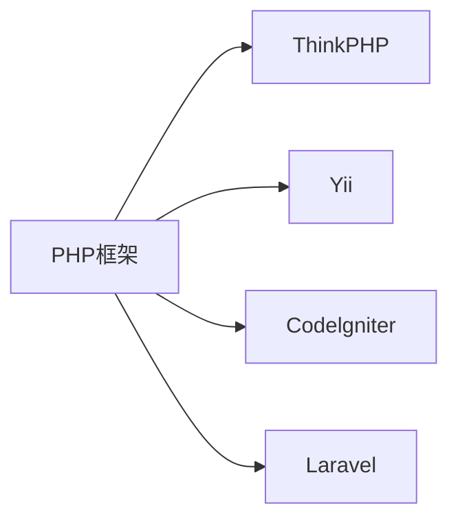
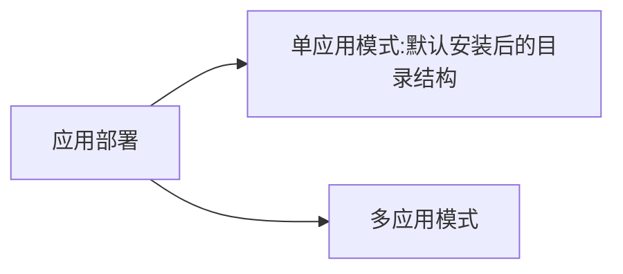

# ThinkPHP6.0学习

## 基础

[目录结构 · ThinkPHP6.0完全开发手册 · 看云](https://www.kancloud.cn/manual/thinkphp6_0/1037483)



  <!-- more -->

[PHP四大主流框架的优缺点总结-php教程-PHP中文网](https://www.php.cn/php-weizijiaocheng-386709.html)

### 版本

PHP 查看版本的四种方法

1. 使用 php 函数phpinfo();

	```php
	<?php
		echo phpinfo();
	?>
	```

2. 使用预定义常量PHP_VERSION查询：

	```php
	<?php
		echo PHP_VERSION;
	?>
	```

3. 使用phpversion()函数查询

	```php
	<?php
	    echo phpversion();
	?>
	```

4. 在命令行输入php –v

	```
	要将PHP的路径添加到环境变量 path 中
	```

ThinkPHP 6.0 版本的环境要求

> PHP >= 7.1.0

### 安装

安装 Compose ==> ThinkPHP 安装

安装Compose https://getcomposer.org/Composer-Setup.exe

更改Compose 镜像

```bash
composer config -g repo.packagist composer https://mirrors.aliyun.com/composer/
```

检查Compose版本

```
composer -V
```

创建ThinkPHP项目 

```
composer create-project topthink/think tp // tp 目录名字
```

更新

```
composer update topthink/framework
```

运行

```
php think run
```

报错

> [Tue Jun 30 22:52:04 2020] Failed to listen on 0.0.0.0:8000
>
> 更换端口

更换端口

```
php think run -p 80
```

> 实际部署中，应该是绑定域名访问到`public`目录，确保其它目录不在WEB目录下面

### 开发规范

#### 目录和文件

- 目录使用小写+下划线；
- 类库、函数文件统一以`.php`为后缀；
- 类的文件名均以命名空间定义，并且命名空间的路径和类库文件所在路径一致；
- 类（包含接口和Trait）文件采用驼峰法命名（首字母大写），其它文件采用小写+下划线命名；
- 类名（包括接口和Trait）和文件名保持一致，统一采用驼峰法命名（首字母大写）；

#### 函数和类、属性命名

- 类的命名采用驼峰法（首字母大写），例如 `User`、`UserType`；
- 函数的命名使用小写字母和下划线（小写字母开头）的方式，例如 `get_client_ip`；
- 方法的命名使用驼峰法（首字母小写），例如 `getUserName`；
- 属性的命名使用驼峰法（首字母小写），例如 `tableName`、`instance`；
- 特例：以双下划线`__`打头的函数或方法作为魔术方法，例如 `__call` 和 `__autoload`；

#### 常量和配置

- 常量以大写字母和下划线命名，例如 `APP_PATH`；
- 配置参数以小写字母和下划线命名，例如 `url_route_on` 和`url_convert`；
- 环境变量定义使用大写字母和下划线命名，例如`APP_DEBUG`；

#### 数据表和字段

- `数据表和字段采用小写加下划线方式命名，并注意字段名不要以下划线开头`，例如 `think_user` 表和 `user_name`字段，不建议使用驼峰和中文作为数据表及字段命名。

### 目录结构



单应用模式 和多应用模式的共同点和区别

```
www  WEB部署目录（或者子目录）
├─app           应用目录
├─config                配置目录
├─view            视图目录
├─route                 路由定义目录
│  ├─route.php          路由定义文件
│  └─ ...   
│
├─public                WEB目录（对外访问目录）
│  ├─index.php          入口文件
│  ├─router.php         快速测试文件
│  └─.htaccess          用于apache的重写
│
├─extend                扩展类库目录
├─runtime               应用的运行时目录（可写，可定制）
├─vendor                Composer类库目录
├─.example.env          环境变量示例文件
├─composer.json         composer 定义文件
├─LICENSE.txt           授权说明文件
├─README.md             README 文件
├─think                 命令行入口文件
```

区别

> 多应用模式部署后，记得删除`app`目录下的`controller`目录（系统根据该目录作为判断是否单应用的依据）。

```
单应用
├─app           应用目录
│  ├─controller      控制器目录
│  ├─model           模型目录
│  ├─ ...            更多类库目录
│  │
│  ├─common.php         公共函数文件
│  └─event.php          事件定义文件

多应用
├─app           应用目录
│  ├─app_name           应用目录
│  │  ├─common.php      函数文件
│  │  ├─controller      控制器目录
│  │  ├─model           模型目录
│  │  ├─view            视图目录
│  │  ├─config          配置目录
│  │  ├─route           路由目录
│  │  └─ ...            更多类库目录
│  │
│  ├─common.php         公共函数文件
│  └─event.php          事件定义文件
```


### 配置 `config目录`

单应用模式

对于单应用模式来说，配置文件和目录很简单，根目录下的`config`目录下面就是所有的配置文件。每个配置文件对应不同的组件，当然你也可以增加自定义的配置文件。

```
├─config（配置目录）
│  ├─app.php            应用配置
│  ├─cache.php          缓存配置
│  ├─console.php        控制台配置
│  ├─cookie.php         Cookie配置
│  ├─database.php       数据库配置
│  ├─filesystem.php     文件磁盘配置
│  ├─lang.php           多语言配置
│  ├─log.php            日志配置
│  ├─middleware.php     中间件配置
│  ├─route.php          URL和路由配置
│  ├─session.php        Session配置
│  ├─trace.php          Trace配置
│  ├─view.php           视图配置
│  └─ ...               更多配置文件
│  
```

单应用模式的`config`目录下的所有配置文件系统都会自动读取，不需要手动加载。如果存在子目录，你可以通过`Config`类的`load`方法手动加载，例如：

```
// 加载config/extra/config.php 配置文件 读取到extra
\think\facade\Config::load('extra/config', 'extra');
```

#### 配置获取

要使用`Config`类，首先需要在你的类文件中引入

```
use think\facade\Config;
```

然后就可以使用下面的方法读取某个配置参数的值：

读取一级配置的所有参数（每个配置文件都是独立的一级配置）

```
Config::get('app');
Config::get('route');
```

读取单个配置参数

```
Config::get('app.app_name');
Config::get('route.url_domain_root');
```

读取数组配置（理论上支持无限级配置参数读取）

```
Config::get('database.default.host');
```

判断是否存在某个设置参数：

```
Config::has('template');
Config::has('route.route_rule_merge');
```

##### 参数批量设置

`Config`类不再支持动态设置某个配置参数，但可以支持批量设置更新配置参数。

```
// 批量设置参数
Config::set(['name1' => 'value1', 'name2' => 'value2'], 'config');
// 获取配置
Config::get('config');
```


## 架构

[请求流程](https://www.kancloud.cn/manual/thinkphp6_0/1075414)
[架构总览](https://www.kancloud.cn/manual/thinkphp6_0/1037486)
[入口文件](https://www.kancloud.cn/manual/thinkphp6_0/1037487)
[多应用模式](https://www.kancloud.cn/manual/thinkphp6_0/1297876)
[URL访问](https://www.kancloud.cn/manual/thinkphp6_0/1037488)
[容器和依赖注入](https://www.kancloud.cn/manual/thinkphp6_0/1037489)
[服务](https://www.kancloud.cn/manual/thinkphp6_0/1037490)
[门面](https://www.kancloud.cn/manual/thinkphp6_0/1037491)
[中间件](https://www.kancloud.cn/manual/thinkphp6_0/1037493)
[事件](https://www.kancloud.cn/manual/thinkphp6_0/1037492)


## 路由


## 控制器


## 请求


## 响应


## 数据库


## 模型


## 视图


## 命令行


## 扩展库